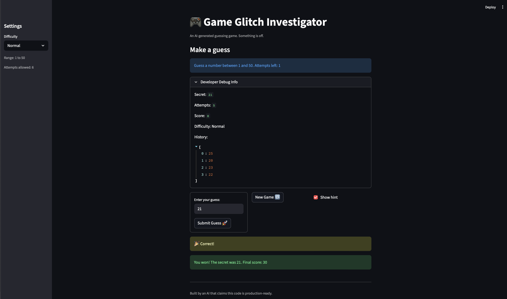

# 🎮 Game Glitch Investigator: The Impossible Guesser

## 🚨 The Situation

You asked an AI to build a simple "Number Guessing Game" using Streamlit.
It wrote the code, ran away, and now the game is unplayable. 

- You can't win.
- The hints lie to you.
- The secret number seems to have commitment issues.

## 🛠️ Setup

1. Install dependencies: `pip install -r requirements.txt`
2. Run the broken app: `python -m streamlit run app.py`

## 🕵️‍♂️ Your Mission

1. **Play the game.** Open the "Developer Debug Info" tab in the app to see the secret number. Try to win.
2. **Find the State Bug.** Why does the secret number change every time you click "Submit"? Ask ChatGPT: *"How do I keep a variable from resetting in Streamlit when I click a button?"*
3. **Fix the Logic.** The hints ("Higher/Lower") are wrong. Fix them.
4. **Refactor & Test.** - Move the logic into `logic_utils.py`.
   - Run `pytest` in your terminal.
   - Keep fixing until all tests pass!

## 📝 Document Your Experience

- [ X ] Describe the game's purpose.
   - Game Glitch Investigator is a 'guess the number' game. The player can choose among 3 difficulties: Easy, Normal, and Hard. All having a range of numbers and an associated attempt counter. At the start of a new game, the player will make a guess and the game will give hints to the player whether to guess higher or lower. If a player successfully guesses the secret number before the number of attempts is depleted, they win! Otherwise they lose. 
- [ X ] Detail which bugs you found. Key bugs I found:
   1. The hints were flipped. For example, the secret number would be 96 but when guessing 100 it would tell me to "Go HIGHER" Going higher would exceed the limit and the hint is inaccurate.
   2. The attempts allowed and ranges for each difficulty level doesn't match their corresponding difficulty level. 
      - Easy should have a range of 1-20 and attempts allowed should be 8. (Change attempts allowed from 6 to 8)
      - Normal should have a range of 1-50 and attempts allowed should be 6. (Change Range from 1-100 to 1-50 and attempts allowed from 8 to 6)
      - Hard should have a range of 1-100 and attempts allowed should be 5 (Change range from 1-50 to 1-100)
   3. New Game button only changes 'Secret' field and reverts 'Attempts' field back to 0. It doesn't erase the history from previous round.
   4. The Widget State Synchronization problem. On Difficulty setting Normal, when guessing numbers 1-10 and entering them using the Submit Guess button, the History only records 1 2 4 6 8 with an attempt of 5, when I pressed the Submit Guess button 10 times.
   5. The game stated "Out of attempts! The secret was __. Score:0" when 1 attempt is still left.
   6. The logic functions and the frontend code are in the same file, app.py.

- [ X ] Explain what fixes you applied.
   1. Changed the return messages from "Too High, Go HIGHER!" to "Too High, Go LOWER!" and from "Too Low, Go LOWER!" to "Too Low, Go HIGHER!" in the check_guess() function. Tested this logic in test_game_logic.py.
   2. In get_range_for_difficulty() and attempt_limit_map, I changed the ranges and attempt limits to match their corresponding difficulty level.
   3. In app.py, in the new_game if statement, I added more default session_state fields. Specifically score, status, and history. And made sure session_state.secret is doesn't refer to a static range of 1 - 100 but instead refer to the ranges of each difficulty level. (low, high)
   4. Implemented st.form() and st.form_submit_button() for the guess input and submit button. These fixes automatically resets the form after submission.
   5. Fixed attempt limit check to be > instead of >=. This allows the player to have the correct number of attempts as specified by the attempt_limit variable.
   6. Moved functions from app.py to logic_utils.py.

## 📸 Demo

## 🚀 Stretch Features

- [ ] [If you choose to complete Challenge 4, insert a screenshot of your Enhanced Game UI here]
